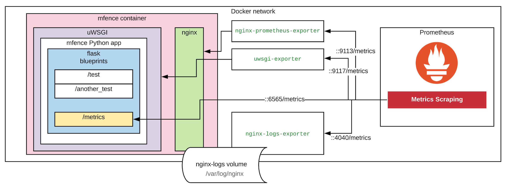

# OBSERVABILITY WORKSHOP

### OVERVIEW
The files found in this repo comprise all the required artifacts to run a sample app and demonstrate the a few metrics' scraping scenarios. The sample app `mfence` is configured using the original `fence` app as inspiration, i.e., a single container running both Nginx (web server) and uWSGI (app server) to host a Python application that operates with Flask Blueprints.

All these 3 logical layers (nginx, uwsgi & python app) carry configuration changes and the addition of new HTTP endpoints to expose metrics, such as:
- Nginx: Number of active connections and HTTP I/O (Reading, Writing and Waiting) = `http://localhost:6565/nginx_status`.
- uWSGI: Workers' activity, status, data transmission, errors = `http://localhost:6565/uwsgi_status`
- mfence's `/metrics` endpoint: This blueprint script produces fictitious metrics. The fake data illustrates what sort of application-specific metrics could be exposed to give service-owners more visibility on interesting events = `http://localhost:6565/metrics/`.

The following diagram illustrates how the metrics are obtained:



### Other details to talk about
- Poetry
- Flask / Blueprints
- Dockerfile (and dynamic config changes in `dockerrun.sh`)

### Application metrics
Examine the `src/mfence/blueprints/metrics.py` script.

### Running local test
```
brew services restart nginx
uwsgi --socket 127.0.0.1:3031 --ini uwsgi-local-run.ini
```

### CHECK SOME STATS
```
pip install uwsgitop
uwsgitop http://127.0.0.1:9191
```

### BUILDING THE DOCKER IMAGE
```
docker build --tag mfence:try1 .
```

### START YOUR APP
```
docker run -it --rm -v $(pwd)/logs/:/var/log/nginx/ -p 6565:80 --name mfence mfence:try1
```

### START THE NGINX METRICS EXPORTER
```
docker run -p 9113:9113 --rm --link mfence:mfence --name nginx-prometheus-exporter nginx/nginx-prometheus-exporter:0.8.0 -nginx.scrape-uri http://mfence/nginx_status
```

### START THE UWSGI METRICS EXPORTER
```
docker run --rm -it -p 9117:9117 --link mfence:mfence --name uwsgi-exporter timonwong/uwsgi-exporter --stats.uri http://mfence/uwsgi_status
```

### START THE NGINX LOGS METRICS EXPORTER
```
docker run --rm --name nginx-logs-exporter -v $(pwd)/logs:/mnt/nginxlogs/ -p 4040:4040 quay.io/martinhelmich/prometheus-nginxlog-exporter mnt/nginxlogs/access_not_json.log
```

### START PROMETHEUS CONTAINER
_debug mode enabled in case you have any metrics scraping issues_
```
docker run --rm -it -p 9090:9090 -v $(pwd)/prometheus.yml:/etc/prometheus/prometheus.yml --link mfence:mfence --link nginx-prometheus-exporter:nginx-prometheus-exporter --link uwsgi-exporter:uwsgi-exporter --link nginx-logs-exporter:nginx-logs-exporter --name myprometheus --entrypoint sh  prom/prometheus -c "/bin/prometheus --config.file=/etc/prometheus/prometheus.yml --storage.tsdb.path=/prometheus --web.console.libraries=/usr/share/prometheus/console_libraries --web.console.templates=/usr/share/prometheus/consoles --log.level=debug"
```

### TESTING

Check the following URLs:
```
# your app metrics
http://localhost:6565/metrics/

# your nginx stats info (not in prometheus-scraping format)
http://localhost:6565/nginx_status

# your uwsgi stats info (not in prometheus-scraping format) 
http://localhost:6565/uwsgi_status

# your nginx metrics
http://localhost:9113/metrics

# your uwsgi metrics
http://localhost:9117/metrics

# your nginx logs metrics
http://localhost:4040/metrics

# your Prometheus console
http://localhost:9090/
```

# START GRAFANA CONTAINER
```
docker run -it --rm --link prometheus:prometheus --name grafana -p 3001:3000 grafana/grafana:7.1.1
```

### STOP ALL CONTAINERS AND TRY DOCKER-COMPOSE

```
# start all
docker-compose up -d

# stop all
docker-compose down
```

#### DOCKER CLEANUP COMMANDS
```
docker stop $(docker ps -a -q)
docker rm $(docker ps -a -q)
docker rmi $(docker images | grep "<none>" | awk '{ print $3}')
```

### Some queries

Just a few prometheus queries to play around with the metrics:
```
avg(cirrus_retries)
rate(uwsgi_worker_transmitted_bytes_total[5m])
rate(nginx_http_response_count_total{status="200", method="GET"}[5m])
# TODO: Add more interesting queries
# e.g., "success rate ((num_failures / total_reqs)*100 )
```

### Screenshots

How it looks like once you put it all together:
TODO: Add screenshots

### Things to consider:
- https://pypi.org/project/prometheus-flask-exporter/
- https://github.com/flask-dashboard/Flask-MonitoringDashboard
- https://rollout.io/blog/monitoring-your-synchronous-python-web-applications-using-prometheus/

